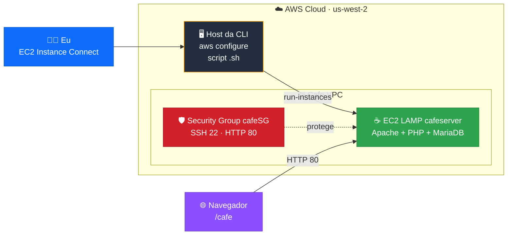
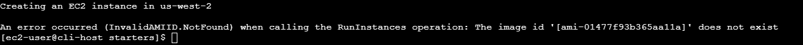
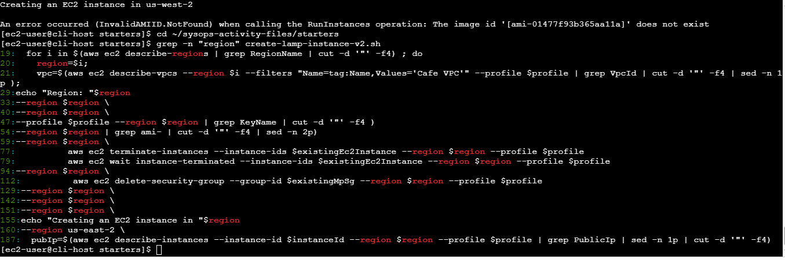
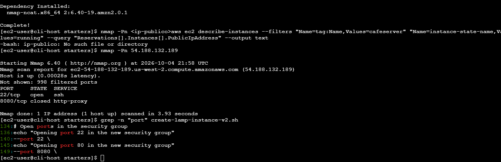
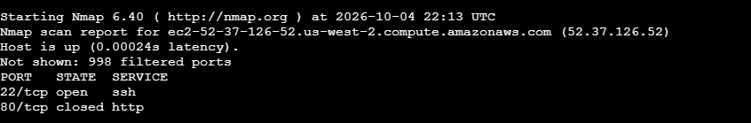
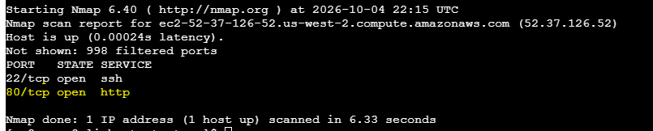
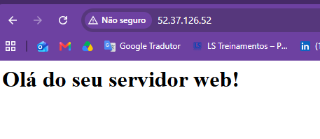
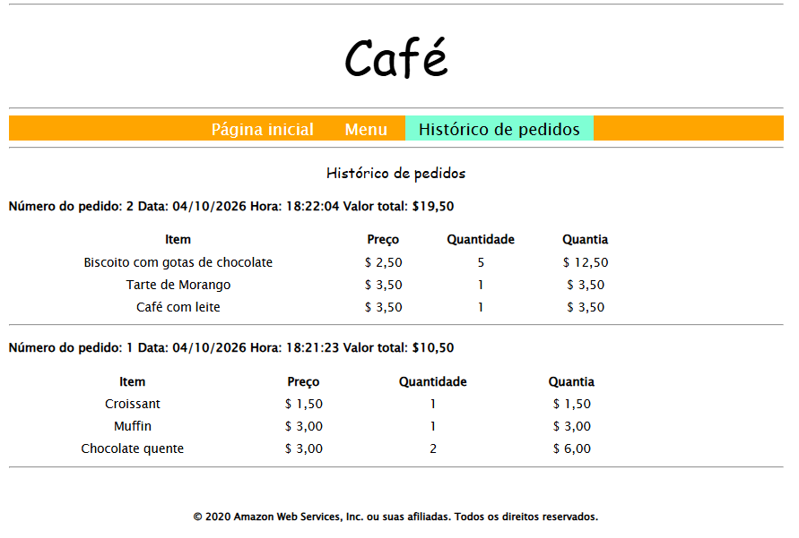

<div align="center">


**Provisionamento de uma instância LAMP pela linha de comando, encontrando e corrigindo erros de um script** 🛠️☁️

</div>

---

## 📌 Sobre o projeto

Neste laboratório, usei a **AWS CLI** para criar uma instância **Amazon EC2 LAMP** (Linux, Apache, MariaDB e PHP) que hospeda o aplicativo web **Café**.

O desafio: o script shell fornecido continha **problemas intencionais**. Meu trabalho foi **ler o script, diagnosticar as falhas e corrigi-las**, validando cada correção até o site ficar no ar e registrar pedidos no banco de dados.

---

## 🎯 Objetivos

- ✅ Conectar a uma instância "host da CLI" com **EC2 Instance Connect**
- ✅ Configurar a **AWS CLI** com `aws configure`
- ✅ Ler e entender um **script Bash** que provisiona infraestrutura
- ✅ Diagnosticar e corrigir **2 problemas** do script
- ✅ Usar o **nmap** para identificar portas bloqueadas
- ✅ Validar o **User Data** pelo log do `cloud-init`
- ✅ Testar o site Café e o registro de pedidos no banco de dados

---

## 🗺️ Arquitetura e fluxo



---

## 🧰 Tecnologias e ferramentas

| 🎨 Categoria | 🔧 Ferramenta | 📝 Uso no projeto |
|:---:|:---:|---|
| ⌨️ Automação | **AWS CLI** | Cria a instância e o Security Group por comandos |
| 📜 Script | **Bash** | Orquestra toda a criação dos recursos |
| ☁️ Compute | **Amazon EC2** | Servidor da aplicação |
| 🛡️ Segurança | **Security Group** | Libera as portas 22 e 80 |
| 🕸️ Web | **Apache httpd + PHP** | Servidor web e aplicação |
| 🗄️ Banco | **MariaDB** | Armazena pedidos do Café |
| 🔍 Diagnóstico | **nmap** | Varredura de portas da instância |
| 📋 Logs | **cloud-init** | Confere a execução do User Data |
| ✏️ Editor | **vi** | Edição do script pelo terminal |

---

## 🔄 O que o script faz

| 🔢 Etapa | 📝 Descrição |
|:---:|---|
| 1️⃣ | Define o tamanho da instância (`t3.small`) |
| 2️⃣ | Percorre as regiões até encontrar a VPC chamada **Cafe VPC** |
| 3️⃣ | Busca ID da sub-rede, par de chaves e AMI |
| 4️⃣ | Limpa recursos de execuções anteriores (instância `cafeserver` e SG `cafeSG`) |
| 5️⃣ | Cria o Security Group com as portas 22 e 80 |
| 6️⃣ | Cria a instância com `run-instances` e o arquivo de **User Data** |
| 7️⃣ | Aguarda e exibe o **IP público** da instância |

---

## 🐞 Troubleshooting

### 🔴 Problema 1: AMI não encontrada

```text
An error occurred (InvalidAMIID.NotFound) when calling the RunInstances operation:
The image id '[ami-01477f93b365aa11a]' does not exist
```



| 🔍 Item | 📝 Detalhe |
|---|---|
| **Sintoma** | O `run-instances` falha dizendo que a AMI não existe |
| **Investigação** | `grep -n "region" create-lamp-instance-v2.sh` listou todas as linhas que usam a região |
| **Causa** | O script encontrou a VPC e a AMI em `us-west-2`, mas a **linha 160** (dentro do `run-instances`) tinha a região **fixa em `us-east-2`**. AMIs são regionais |
| **Correção** | Usar a variável `$region`, como o restante do script |



```diff
- --region us-east-2 \
+ --region $region \
```

---

### 🔴 Problema 2: porta 80 bloqueada no Security Group

| 🔍 Item | 📝 Detalhe |
|---|---|
| **Sintoma** | Instância criada com IP público, mas `http://<ip>` não abria |
| **Diagnóstico** | `nmap -Pn <ip>` mostrou **22/tcp open** e **8080/tcp closed**, sem a porta 80 |
| **Investigação** | `grep -n "port" create-lamp-instance-v2.sh` revelou a regra da porta 80 usando `--port 8080` |
| **Causa** | A **linha 149** liberava a porta **8080** no Security Group, embora a mensagem do script dissesse "Opening port 80". O Apache escuta na 80 |
| **Correção** | Ajustar a regra para a porta 80 |



```diff
- --port 8080 \
+ --port 80 \
```

---

### 🟡 Observação: porta 80 `closed` logo após criar a instância

Depois de corrigir o Security Group, o nmap passou a mostrar a **porta 80 como `closed`**. Isso indica que o tráfego já chegava à instância, mas o **Apache ainda não estava escutando**: o **User Data** continuava instalando os pacotes.



Poucos minutos depois, uma nova varredura mostrou a **porta 80 `open`**.

> 💡 **Lição:** o User Data é executado em segundo plano após o boot. Uma porta `closed` logo após criar a instância nem sempre é erro de configuração: pode ser só a inicialização ainda em andamento.

---

## ✅ Resultados

### 🟢 Porta 80 aberta (nmap)



### 🌐 Servidor web respondendo no navegador



### ☕ Site Café registrando pedidos no MariaDB

Dois pedidos feitos pelo site e gravados no banco de dados da instância:



---

## 🪜 Passo a passo resumido

1. 🔌 Conectar ao **host da CLI** pelo EC2 Instance Connect
2. 🔑 Rodar `aws configure` (chaves, região e formato `json`)
3. 💾 Criar backup do script: `cp create-lamp-instance-v2.sh create-lamp-instance.backup`
4. 👀 Ler o script e o arquivo de User Data
5. ▶️ Executar o script e observar a falha da AMI
6. 🛠️ Corrigir a região na **linha 160** e executar de novo
7. 🔍 Rodar `nmap -Pn <ip>` e investigar a porta 80
8. 🛠️ Corrigir a porta na **linha 149** e executar de novo
9. ⏳ Aguardar o User Data terminar e confirmar a porta 80 `open`
10. ☕ Acessar `http://<ip>` e `http://<ip>/cafe` e testar pedidos

---

## 🧠 Aprendizados

- ⌨️ Como **provisionar recursos pela AWS CLI**, sem usar o console
- 🌎 Recursos como **AMIs são regionais**: região errada gera erro de "não encontrado"
- 🔍 Usar **nmap** para separar problema de rede (`filtered`) de problema de aplicação (`closed`)
- 🛡️ Revisar as regras do **Security Group** antes de investigar o servidor
- 🔎 Usar **`grep -n`** para localizar rapidamente a linha com problema em um script
- ⏳ O **User Data** roda de forma assíncrona: é preciso esperar a conclusão antes de testar
- 📜 Habilidade de **ler e depurar scripts Bash** de terceiros

---

## 🔐 Boas práticas de segurança

> ⚠️ **Nunca publique no GitHub** chaves de acesso (`AccessKey`/`SecretKey`) ou prints que mostrem credenciais. Os IPs deste laboratório são temporários, mas o hábito vale para projetos reais.
>
> 💰 Ao terminar, **encerre a instância** para evitar custos.

---

<div align="center">

### 👩‍💻 Autora

**LUCIANA RB ASSIS**

[](https://www.linkedin.com/in/lucianarbassis)
[](https://github.com/ALRA-CODE)

⭐ Se este projeto foi útil, deixe uma estrela no repositório!


</div>
